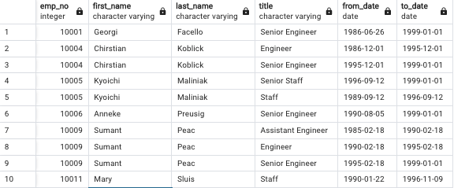
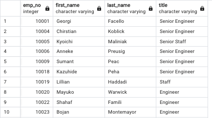
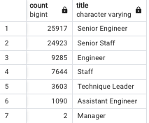

# Pewlett-Hackard-Analysis

## Project Overview

The purpose of this project was to determine how many employees would be retiring and what titles they held. Another part of the project was to determine who was elgible to take part of the mentorship program. Using the born between dates of January 1, 1952 and December 31, 1955, I used a query that woud retirve the employee number, first name, last name, title, from dates and to dates. 

## Results

- Using the retirement_titles.csv we are able to see each employee and how long they worked for the company.

- For the uniquie_titles.csv we are able to see each employees titles that are at the retiriement age.

- The retiring_titles.csv shows that of the 72,464 retiring most of the them are Senior staff members which make up 50,840 members or about 70% of the retirign staff.

- The mentorship_eligibility.csv shows that most of the eligilbe employees hold a senior title. 

## Summary

In summary, the company will need to find a way to fill about 70 percent of the vacant positions that will be left by the retiring workforce in the next few years. Acting on this will alleviate the impact of the “silver tsunami” situation. If the company can find ways to attract and train the younger generations of workers then the effect would be considerably less to manage. Right now there appears to be enough talent and knowledge to mentor the incoming and internal younger workers.

